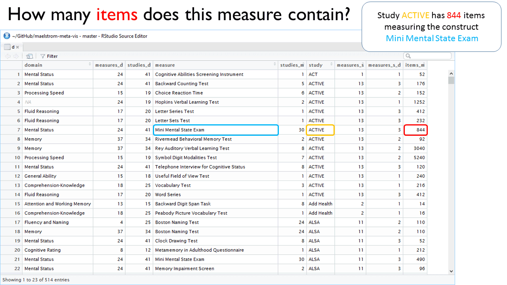

<!-- These two chunks should be added in the beginning of every .Rmd that you want to source an .R script -->
<!--  The 1st mandatory chunck  -->
<!--  Set the working directory to the repository's base directory -->
```{r, echo=F, message=F} 
#Don't combine this call with any other chunk 
# cat("Working directory: ", getwd()) # check where you are
  library(knitr)
# Rmd is in "./reports/reportA/reportA.Rmd", but now the root is "./"
  knitr::opts_knit$set(root.dir='../../') 
```

<!--  The 2nd mandatory chunck  -->
<!-- Set the report-wide options, and point to the external code file. -->
```{r set_options, echo=F}
# set options shared by all chunks
opts_chunk$set(
  results='show', 
  message = TRUE,
  comment = NA, 
  tidy = FALSE,
  fig.height = 4, 
  fig.width = 5.5, 
  out.width = "550px",
  fig.path = 'figure_rmd/',     
  dev = "png",
  dpi = 400
  # fig.path = 'figure_pdf/',     
  # dev = "pdf"#,
  # dev.args=list(pdf = list(colormodel = 'cmyk'))
)
echoChunks <- FALSE
options(width=120) #So the output is 50% wider than the default.
# connect to the file with the underlying R script  
read_chunk("./reports/coverage-cognitive/coverage-cognitive.R") 
```


<!-- Load 'sourced' R files.  Suppress the output when loading packages. --> 
```{r load-packages, echo=echoChunks, message=FALSE}
```


<!-- Load the sources.  Suppress the output when loading sources. --> 
```{r load-sources, echo=echoChunks, message=FALSE}
```

<!-- Load any Global functions and variables declared in the R file.  Suppress the output. --> 
```{r declare-globals, echo=FALSE, results='hide', message=FALSE, warning=F}
```


```{r utility-functions,echo=FALSE, results='hide', message=FALSE}
```

<!-- Declare any global functions specific to a Rmd output.  Suppress the output. --> 
```{r, echo=echoChunks,echo=FALSE, results='hide', message=FALSE}
#Put code in here.  It doesn't call a chunk in the codebehind file.
```


<!-- Load the datasets.   -->
```{r load-data, echo=FALSE, results='hide', message=FALSE}
```

<!-- Inspect the datasets.   -->
```{r inspect-data, echo=FALSE, results='hide', message=FALSE}
```

<!-- Tweak the datasets.   -->
```{r tweak-data-1, echo=FALSE, results='hide',message=FALSE, warning=F}
```

```{r tweak-data-2, echo=FALSE, results='hide', message=FALSE, warning=F}
```

```{r tweak-data-3, echo=FALSE, results='hide', message=FALSE, warning=F}
```

To remember where the data comes from please review [data origin report]() or flip through [data origin slides][data-origin.pdf] and ask [six-questions][six-questions.pdf] about each cognitive measure. 


> The columns with numbers give answers to specific questions:  

  - `measures_d`   - how many measures does this domain have?   
  - `studies_d`    - how many studies have at least one measure in this domain?  
  - `studies_m`    - how many studies have this measure?  
  - `measures_s`   - how many measures does this study have?    
  - `measures_s_d` - how many measures does this study have in this domain?   
  - `items_m`      - how many items does this measure contain?

 

```{r basic-table, echo=F, results='show', message=FALSE}
```

The same table as above is presented below in an alternative interface.   

```{r basic-table-2, echo=F, results='show', message=FALSE}
```


# Session Info
```{r session-info, echo=FALSE}
cat("Report rendered by", Sys.info()["user"], "at", strftime(Sys.time(), "%Y-%m-%d, %H:%M %z"))
sessionInfo()
```


[data-origin.pdf]:https://rawgit.com/maelstrom-research/maelstrom-meta-vis/2f4f3280274eb25d7aeaedd465fffaefd3a56c9e/reports/coverage-cognitive/data-origin/1-data-origin.pdf

[six-questions.pdf]:https://rawgit.com/maelstrom-research/maelstrom-meta-vis/2f4f3280274eb25d7aeaedd465fffaefd3a56c9e/reports/coverage-cognitive/six-questions/1-six-questions.pdf

