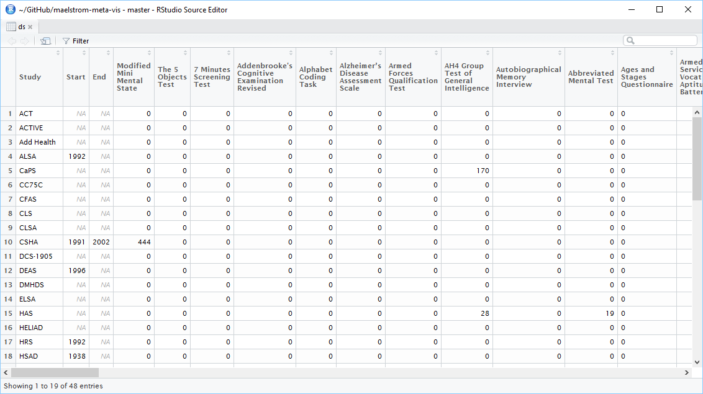
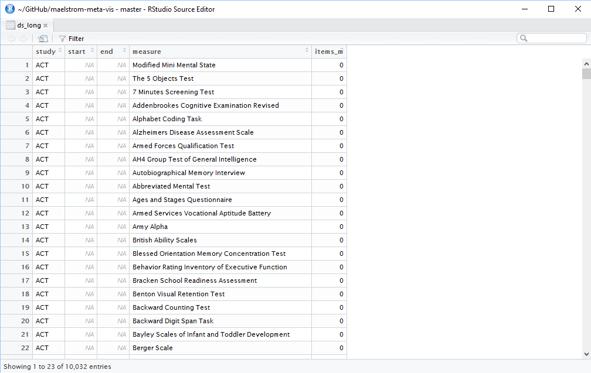
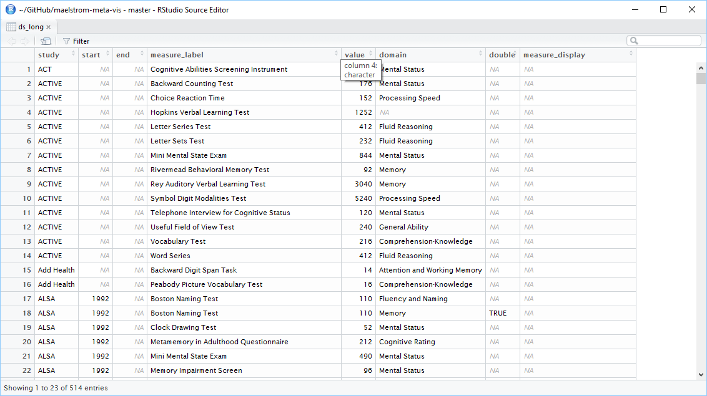
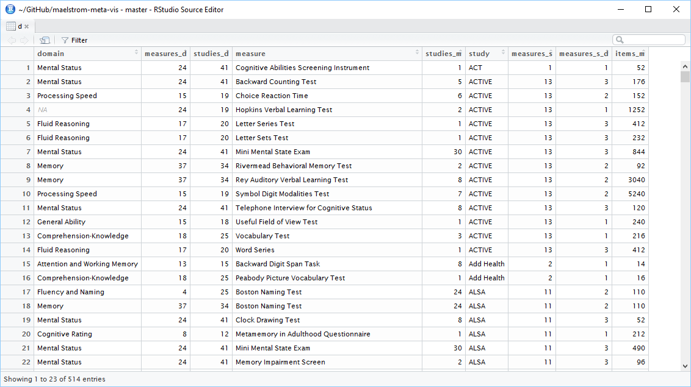

<!-- These two chunks should be added in the beginning of every .Rmd that you want to source an .R script -->
<!--  The 1st mandatory chunck  -->
<!--  Set the working directory to the repository's base directory -->
```{r, echo=F, message=F} 
#Don't combine this call with any other chunk 
# cat("Working directory: ", getwd()) # check where you are
  library(knitr)
# Rmd is in "./reports/reportA/reportA.Rmd", but now the root is "./"
  knitr::opts_knit$set(root.dir='../../') 
```

<!--  The 2nd mandatory chunck  -->
<!-- Set the report-wide options, and point to the external code file. -->
```{r set_options, echo=F}
# set options shared by all chunks
opts_chunk$set(
  results='show', 
  message = TRUE,
  comment = NA, 
  tidy = FALSE,
  fig.height = 4, 
  fig.width = 5.5, 
  out.width = "550px",
  fig.path = 'figure_rmd/',     
  dev = "png",
  dpi = 400
  # fig.path = 'figure_pdf/',     
  # dev = "pdf"#,
  # dev.args=list(pdf = list(colormodel = 'cmyk'))
)
echoChunks <- FALSE
options(width=120) #So the output is 50% wider than the default.
# connect to the file with the underlying R script  
read_chunk("./reports/coverage-cognitive/coverage-cognitive.R") 
```


<!-- Load 'sourced' R files.  Suppress the output when loading packages. --> 
```{r load-packages, echo=echoChunks, message=FALSE}
```


<!-- Load the sources.  Suppress the output when loading sources. --> 
```{r load-sources, echo=echoChunks, message=FALSE}
```

Skip ahead to the [dedicated report][barebones] with dynamic data tables. 

# Glossary
Review object definitions to assist you in reading the report. 
<!-- Load any Global functions and variables declared in the R file.  Suppress the output. --> 
```{r declare-globals, echo=T, results='asis', message=FALSE, warning=F}
```

Review functions definitions to assist you in reading the report.
```{r utility-functions, echo=T, results='show', message=FALSE}
```

<!-- Declare any global functions specific to a Rmd output.  Suppress the output. --> 
```{r, echo=echoChunks, message=FALSE}
#Put code in here.  It doesn't call a chunk in the codebehind file.
```

# Data Origin

Using Maelstrom website, we obtain a `coverage table` for constructs of cognitive functioning and import these data into R environment:


To examine the expanded origin of the data at your own pace, please consult [data-origin.pdf][data-origin.pdf]

# Load Data

<!-- Load the datasets.   -->
```{r load-data, echo=TRUE, results='show', message=FALSE}
```

<!-- Inspect the datasets.   -->
```{r inspect-data, echo=TRUE, results='show', message=FALSE}
```


# Convert to long
<!-- Tweak the datasets.   -->
```{r tweak-data-1, echo=T, results='show', message=FALSE, warning=F}
```


# Add domain structure 

Each of the cognitive measures available from the Maelstrom website has been placed in one or more `domains`, groups of constructs of cogntive function that some how caputure a higher-order property (e.g. "Memory", "Mental Status"), as conceptualized by mondern theories of cognitive testing. Please consult [this issue](https://github.com/maelstrom-research/maelstrom-meta-vis/issues/2) to review discussion on conceptualizing a `cognitive domain`. The structure of this mapping (measures to cogntive domains) has been captured in a stand-alone `csv` file [`./data-public/meta/coverage-cognitive-dead.csv`][meta-dead] and can be amended as necessary, as more measures become available or as the grouping evolves. 

```{r tweak-data-2, echo=T, results='show', message=FALSE, warning=F}
```



# Compute counts
```{r tweak-data-3, echo=T, results='show', message=FALSE, warning=F}
```



To examine each slide at your own pace, please consult [six-questions.pdf][six-questions.pdf]


# Display results

Please consult a [dedicated report][barebones] with an additional table view. 


> The columns with numbers give answers to specific questions:  

  - `measures_d`   - how many measures does this domain have?   
  - `studies_d`    - how many studies have at least one measure in this domain?  
  - `studies_m`    - how many studies have this measure?  
  - `measures_s`   - how many measures does this study have?    
  - `measures_s_d` - how many measures does this study have in this domain?   
  - `items_m`      - how many items does this measure contain?

```{r basic-table, echo=F, results='show', message=FALSE}
```


Please consult a [dedicated report][barebones] for the ease of handling the dynamic table. It also contains and additional table view that permits data export. 

# Session Info

To reproduces this report, please follow the instructions displayed at the main [`README.me`][main-readme] of our github project

```{r session-info, echo=FALSE}
cat("Report rendered by", Sys.info()["user"], "at", strftime(Sys.time(), "%Y-%m-%d, %H:%M %z"))
sessionInfo()
```


[data-origin.pdf]:https://rawgit.com/maelstrom-research/maelstrom-meta-vis/master/reports/coverage-cognitive/data-origin/1-data-origin.pdf

[six-questions.pdf]:https://rawgit.com/maelstrom-research/maelstrom-meta-vis/master/reports/coverage-cognitive/six-questions/1-six-questions.pdf

[coverage-cognitive]:https://rawgit.com/maelstrom-research/maelstrom-meta-vis/master/reports/coverage-cognitive/coverage-cognitive.html

[barebones]:https://rawgit.com/maelstrom-research/maelstrom-meta-vis/master/reports/coverage-cognitive/coverage-cognitive-barebone.html

[meta-dead]:https://github.com/maelstrom-research/maelstrom-meta-vis/blob/master/data-public/meta/coverage-cognitive-dead.csv

[main-readme]:https://github.com/maelstrom-research/maelstrom-meta-vis/blob/master/README.md